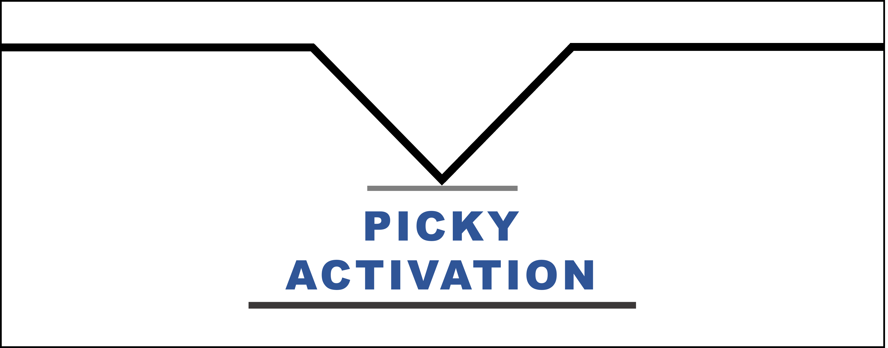
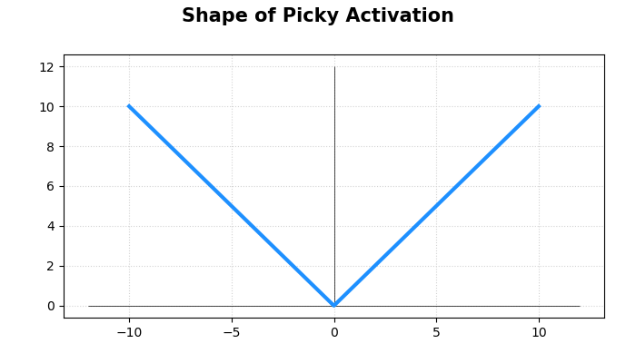
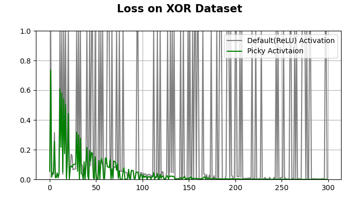
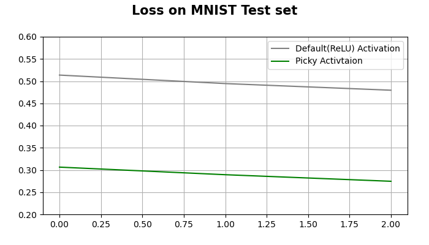
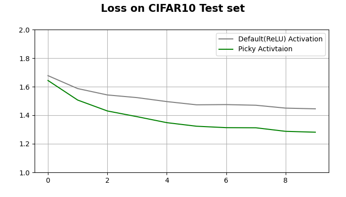
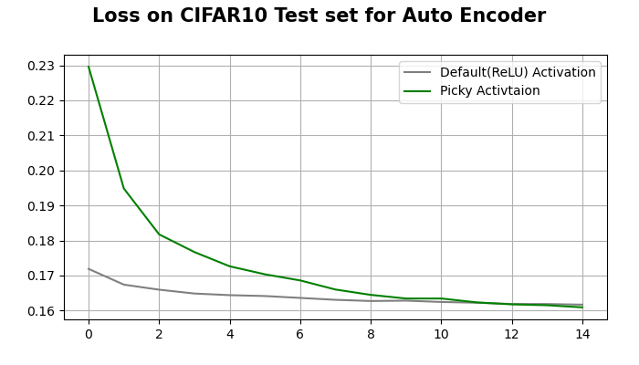
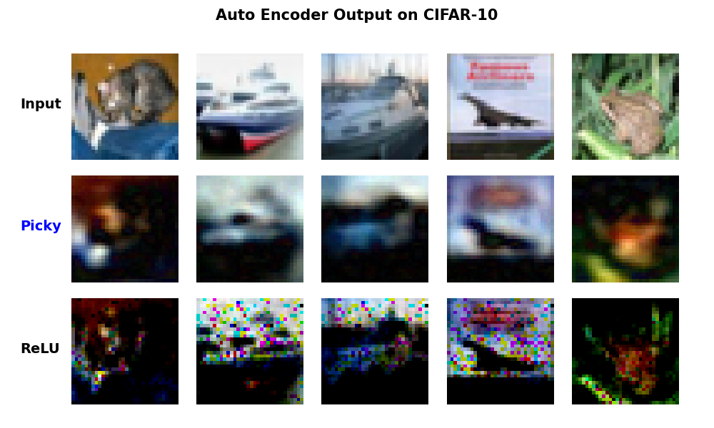

<br>

<br>

### 이 저장소(Repository)는 「XOR 문제 해결 가능한 새로운 활성화 함수(Picky Activation) 제시」에 대한 내용을 다루고 있습니다.

***
작성자: YAGI<br>

최종 수정일: 2023-04-12
+ 2023.04.12: 코드 작성 완료
+ 2023.04.13: Auto Encoder 예제 추가
***

<br>

***
+ 프로젝트 기간: 2023-04-04 ~
***
<br>

## 프로젝트 요약
&nbsp;&nbsp; 현재 주로 사용되는 'ReLU', 'Sigmoid', 'Tanh'와 같은 활성화 함수를 기반으로 하는 단일 퍼셉트론은 XOR 문제를 해결 할 수 없다. 본 프로젝트에서는 단일 퍼셉트론 만으로 XOR 문제를 최적화할 수 있으며 나아가 다른 태스크에 대하여 기존 활성화 함수보다 비슷하거나 준수한 성능을 제시하는 'Picky' 활성화 함수를 제안 한다. Equation 1은 Picky 활성화 함수의 식을 제시한 것이다.

<br>

$$
y_i = 
    \begin{cases}
        x_i & \text{if $x_i$ $\geq$ 0}\\
        -x_i & \text{if $x_i$ < 0}
    \end{cases}
$$

<b>Eq 1</b>. Equation of Picky Activation

<br>

&nbsp;&nbsp; Picky 활성화 함수는 0을 중심으로 대칭의 형태를 띈다. 특정 입력에 대하여 비활성화되는 것이 마치 편식(Pick)하는 것과 같아「Picky」로 명명하였다. Fig 1은 Picky 활성화 함수를 시각화 한 것이다.

<br>

<b>Fig 1</b>. Shape of Picky Activation Function.

<br>

&nbsp;&nbsp; Picky 활성화 함수를 사용함으로써 단일 퍼셉트론만으로 XOR 문제를 해결할 수 있음을 확인하였다. Fig 2는 Picky 활성화 함수와 ReLU 활성화 함수를 사용한 각각의 단일 퍼셉트론의 XOR 문제에 대한 손실값의 변화를 시각화한 것이다. 두 퍼셉트론의 파라미터는 동일한 값을 가진 상태로 초기화하였으며, Adam 옵티마이저를 사용하여 학습율 0.01, 배치 사이즈 1로 설정하여 MSE 손실함수로 1회 학습하였다.

<br>

<b>Fig 2</b>. Loss On XOR Dataset.

<br>

&nbsp;&nbsp; 나아가 MNIST, CIFAR-10과 같은 이외의 태스크에 대해, Picky 활성화 함수를 적용한 다층 신경망이 ReLU와 같은 기존 활성화 함수를 적용한 다층 신경망에 비해 그와 비슷하거나 더 준수한 성능을 제시하였다. Fig 3과 Fig 4는 각각 MNIST와 CIFAR-10의 테스트 데이터 셋에 대한 Picky 활성화 함수와 ReLU 활성화 함수의 손실값 변화를 시각화 한 것이다.

<br>

<b>Fig 3</b>. Loss On MNIST Test set. 한 층으로 이루어진 모델. 32 배치 사이즈로 Cross Entropy 손실 함수를 사용하여 3 Epoch 학습.

<br>

<br>

<b>Fig 4</b>. Loss On CIFAR-10 Test set. 두 층으로 이루어진 모델. 128 배치 사이즈로 Cross Entropy 손실 함수를 사용하여 10 Epoch 학습.

<br>

&nbsp;&nbsp; Auto Encoder 본문

<br>

<b>Fig 5</b>. Loss On CIFAR-10 Test set for Auto Encoder.

<br>

<br>

<b>Fig 6</b>. Auto Encoder Output on CIFAR-10.

<br><br>

## Getting Start

### Example
```python
#XOR Example
$ python main.py --mode logic --device cuda

#MNIST Example
$ python main.py --mode mnist --device cuda

#CIFAR-10 Example
$ python main.py --mode cifar10 --depth 2 --device cuda

#Auto Encoder Example
$ python main.py --mode AE --depth 3 -- device cuda

#학습 완료 후 './figures/' 디렉토리에 그래프 저장됨.

```
<br>

### Use Picky Activation
```python
import torch
import activation


x = torch.randn(size=(1, 5)) #Input Tensor: Batch(1) x Feature(5)
print(f'input: {input_tensor}')


#함수형 활성화 함수
y_hat = activation.picky_(x)
print(f'functional y_hat: {y_hat}')


#클래스형 활성화 함수
actF = activation.Picky()
y_hat = actF(x)
print(f'functional y_hat: {y_hat}')

```
***

<br><br>

## 개발 환경
**Language**

    + Python 3.9.12

    
**Library**

    + tqdm 4.64.1
    + pytorch 1.12.0

<br><br>

## License
This project is licensed under the terms of the [MIT license](https://github.com/YAGI0423/picky_activation/blob/main/LICENSE).
